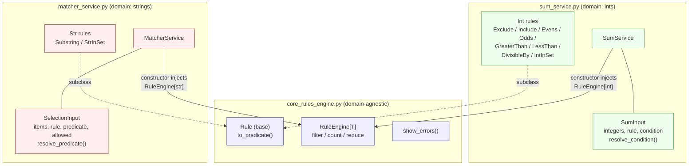

# Rule-Based Sum and Selection Examples

## Overview



Key relationships the diagram is meant to show:
- Vertical arrows = dependency injection. Services depend on the engine. The engine does not depend on services. No cycles.
- Dotted subclass lines = inheritance. Domain rules extend the abstract Rule base so Pydantic can discriminate on kind.
- Solid --- lines = composition. Each service owns its rules and its input container.
- No line between SumService and MatcherService. That's the point. They are siblings, not collaborators.

This repo `v4` contains:

1. **`core_rules_engine.py.py`** — RuleEngine is generic and stateless. It does filter, count, reduce. The Pydantic + callable-rule file for filtering (primitive operation (filter, count, reduce) goes in the engine)
2. **`sum_service.py`** — SumService injects the engine and calls reduce(..., operator.add, 0). The simple selection/counting functions, plus a structured Pydantic/rule-based variant.
3. **`matcher_service.py`** — MatcherService injects the engine and calls filter / count. The simple selection/matching functions, plus a structured Pydantic/rule-based variant.
4. **`demo.py`** - The demo file.

SumService and MatcherService as siblings, both composing the same RuleEngine. 

- Rules stay domain-specific (int rules vs str rules) because Pydantic discriminated unions are cleaner that way.

- DI is the seam: swap the engine, mock it in tests, or add a new service (e.g. AverageService) without touching the engine.

- Cycle risk. Today SumService doesn’t need MatcherService. Tomorrow maybe MatcherService needs a sum. Now you have a cycle. You start injecting lazy proxies or event buses to break it. Bad.

- Wrong coupling. “Sum” and “match” are sibling domains. A dependency between them says one domain is part of the other. It isn’t. Summing numbers and matching strings are peers.

- Policy (precedence, defaults, logging) is a policy object.

- Test pain. To test MatcherService, you now need a working SumService, which needs a RuleEngine, which needs… You’ve turned a two-object test into a graph. 

- Single responsibility. RuleEngine knows only “iterate, test, accumulate.” SumService knows only “add numbers.” MatcherService knows only “select/count strings.” Rules know only how to become predicates.

- Open/closed. Add a new domain service (AverageService, MaxService) or new rules without touching the engine.

- Dependency inversion. Services depend on RuleEngine, not on each other. We can inject a mock or a logging engine in tests.

- DRY. Filter, count, and reduce logic live once in the engine.

- KISS/YAGNI caveat. If we only ever need to sum ints and match strings in a script, the three original functions are still better. This design pays off when rules come from JSON/UI/DB and we’ll add more domains.

Honest trade-off: the merged version is more machinery. It’s justified when rules are data-driven and we have multiple domains. For a one-off list filter, keep the three functions. We can use the engine when the rules outlive the script.

Potential further consolidation: both services need to resolve `condition > rule > default.` Right now that logic lives in two free functions, `resolve_int_predicate` and `resolve_str_predicate`. If that policy grew (audit logging, precedence from config, defaults from DB), we extract it.

### Ouput

```
  --- match by condition ---
  ['wolf', 'wolf pack', 'wolf', 'wolves', 'wolf']
  ['wolf', 'wolf', 'wolves', 'wolf']

  --- match by attributes ---
  ['wolf', 'wolf', 'wolf']
  ['wolf', 'wolf', 'wolves', 'wolf']

  --- match by rule ---
  SubstringRule   {'kind': 'substring', 'value': 'wol'}         -> ['wolf', 'wolf pack', 'wolf', 'wolves', 'wolf']
  StrInSetRule    {'kind': 'str_in_set', 'values': {'wolves', 'wolf'}} -> ['wolf', 'wolf', 'wolves', 'wolf']

  --- via SelectionInput ---
  ['wolf', 'wolf pack', 'wolf', 'wolves', 'wolf']

  --- count ---
  {'wolf': 3, 'cat': 1, 'wolf pack': 1, 'wolves': 1}

  --- validation errors (aggregated) ---
  rejected (empty list): 1 error(s)
    - [too_short] items: List should have at least 1 item after validation, not 0
  rejected (non-bool predicate): 1 error(s)
    - [value_error] predicate: Value error, predicate must return bool

  --- END ---

  --- sum by rule ---
  ExcludeRule          {'kind': 'exclude', 'value': 2}               -> 19
  IncludeRule          {'kind': 'include', 'value': 2}               -> 2
  EvensRule            {'kind': 'evens'}                             -> 12
  OddsRule             {'kind': 'odds'}                              -> 9
  GreaterThanRule      {'kind': 'greater_than', 'threshold': 3}      -> 15
  LessThanRule         {'kind': 'less_than', 'threshold': 3}         -> 3
  DivisibleByRule      {'kind': 'divisible_by', 'divisor': 3}        -> 9
  IntInSetRule         {'kind': 'int_in_set', 'values': [1, 4, 5]}   -> 10

  --- sum by condition ---
  19
  19

  --- via SumInput ---
  12

  --- validation errors (aggregated) ---
  rejected (duplicates): 1 error(s)
    - [value_error] integers: Value error, duplicates not allowed
  rejected (non-bool condition): 1 error(s)
    - [condition_not_bool] condition: condition must return bool, got int
  rejected (empty list): 1 error(s)
    - [too_short] integers: List should have at least 1 item after validation, not 0

  --- END ---
```

This repo `v3` contains two related examples:

1. **`sum_rule_engine.py`** — the Pydantic + callable-rule file for filtering and summing integers.
2. **`matcher_rule_engine.py`** — the simple selection/counting functions, plus a structured Pydantic/rule-based variant.

Together they show two ends of the same design space:

- **Simple functions** for small, one-off problems.
- **Data-driven rule engines** for configurable, validated, extensible behaviour.

The same principles appear in both, but the trade-offs differ. The simpler file is often the better default. The structured file is useful when rules come from JSON, an API, a database, or a user interface.

---

## Core Ideas

Both files revolve around a few small concepts:

- **Predicate** — `Callable[[T], bool]`, e.g. `lambda n: n != 2`.
- **Rule** — a data object that knows how to turn itself into a predicate, e.g. `ExcludeRule.to_condition()`.
- **Adapter** — `TypeAdapter` parses raw dict/list data into a typed rule.
- **Container** — `SumInput` / `SelectionInput` validates input and resolves the active predicate.
- **Service** — `SumClass` / `AnimalSelector` performs operations using an injected predicate.
- **Composition root** — `main()` wires everything together and handles I/O.

---

## Design Principles

DRY (Don't Repeat Yourself) is about having a **single source of truth**, not about eliminating every repeated line.

Where it shows up:

- `rule.to_condition()` centralises predicate creation for each rule.
- `resolve_condition()` centralises precedence: explicit condition > rule > default.
- `count_items()` uses `counts.get(item, 0) + 1` instead of branching duplicate increment logic.
- `select_by_condition()` is generic over any predicate, so filtering logic is written once.
- `TypeAdapter` avoids repeating parsing and validation for each rule type.
- `show_errors()` centralises error formatting.

Caveat: DRY can be overdone. In the simple animal file, three small functions are clearer than a generic framework. Repetition is sometimes cheaper than the wrong abstraction.

Core is domain-blind. It never imports from either service. No cycles possible.

Services are siblings. They share the engine, not each other. SumService and MatcherService don't know one another exist.

Rules live with their domain. ExcludeRule is meaningless to the matcher; SubstringRule is meaningless to the sum. Keeping them in the right file enforces this.

DI is constructor injection. SumService(RuleEngine[int]) and MatcherService(RuleEngine[str]). Same class, two type parameters. You can pass a mock, a logging engine, or share one instance if you like.

Composition root is per file's main(). In a real app we'd have one entry point that builds the engine once and hands it to whichever service it needs.

---

## SOLID

### S — Single Responsibility

Each unit has one reason to change:

- `ExcludeRule`, `IncludeRule`, `EvensRule`, etc. each model one rule and convert it to a predicate.
- `SumInput` validates input and resolves the active condition.
- `SumClass` performs summation.
- `show_errors` formats validation errors.
- `AnimalSelector` methods each do one operation: select by condition, select by attributes, count items.
- `SelectionInput` validates and resolves predicates.

### O — Open/Closed

The rule engines are open for extension but closed for modification:

- Add a new rule by creating a new `BaseModel` subclass and adding it to the `AnyRule` union. Existing rules are untouched.
- In the simple animal file, add a new predicate by passing a new lambda. `select_by_condition` does not change.

### L — Liskov Substitution

Rule objects and predicates are substitutable:

- Every rule exposes `to_condition()` returning a `Condition`.
- Every predicate is a `Callable[[T], bool]`.
- `partial`, lambdas, set membership, and rule-derived conditions can all be used wherever a predicate is expected.

### I — Interface Segregation

Interfaces are small and focused:

- `Condition = Callable[[int], bool]`
- `Predicate = Callable[[Item], bool]`
- Separate methods for selection by condition vs selection by attributes vs counting, rather than one god method.

### D — Dependency Inversion

High-level code depends on abstractions, not concrete rules:

- `SumClass` depends on `Condition`, not on `ExcludeRule`.
- `AnimalSelector` depends on `Predicate`, not on `SubstringRule`.
- `SumInput` can accept a live callable or a data rule; the caller decides.

---

## Other Principles

- **KISS** — simple functions are often enough. The elaborate rule engine is justified only when rules are configurable, validated, or external.
- **YAGNI** — do not build a rule engine for a one-off filter. The simple `animal_selector.py` is the better default.
- **Composition over inheritance** — rules compose into predicates; there is no deep class hierarchy.
- **Strategy pattern** — each rule is a strategy for filtering.
- **Adapter pattern** — `RuleAdapter`, `rule.to_condition()`, and `TypeAdapter` adapt raw data into behaviour.
- **Data-driven design** — rules are data, e.g. `{"kind": "exclude", "value": 2}`, validated and converted to behaviour.
- **Functional core, imperative shell** — pure predicates and list comprehensions; `main()` handles I/O.
- **Validation at boundaries** — Pydantic checks types, duplicates, and bool-returning predicates.
- **Fail fast, aggregate errors** — `ValidationError` collects multiple issues; `show_errors` prints them.

---

## Architectural Concepts

- **Layering**
  - Domain/rules: Pydantic models.
  - Application/service: `SumClass`, `AnimalSelector`.
  - Boundary/adapters: `TypeAdapter`, `validate_call`.
  - Composition root: `main`.

- **Discriminated union** — the `kind` field routes to the correct rule model.

- **Dependency injection** — predicates and conditions are passed into service methods.

- **Precedence resolution** — `condition` overrides `rule`; `allowed` overrides `rule` in the animal variant.

- **Runtime validation** — `@validate_call` validates method arguments; `BaseModel` validates payloads.

- **Testability** — pure functions are easy to test; rules can be instantiated without I/O.

---

## File-by-File Notes

### `sum_rule_engine.py`

- Rule models: `ExcludeRule`, `IncludeRule`, `EvensRule`, `OddsRule`, `GreaterThanRule`, `LessThanRule`, `DivisibleByRule`, `InSetRule`.
- `AnyRule` is a discriminated union on `kind`.
- `SumInput` holds `integers`, optional `rule`, optional `condition`; validates no duplicates and bool-returning condition; `resolve_condition()` picks the active predicate.
- `SumClass` demonstrates multiple sum implementations: loop, generator, list wrapper, staticmethod, adapter-based, and `validate_call`.
- `main()` shows rule-driven examples, happy paths, coercion, and error aggregation.
- Design note: comments in `main()` may be stale after `integers` changes. Update expected outputs when data changes.

### `animal_selector.py`

- Simple version:
  - `select_by_condition(items, predicate)`
  - `select_by_attributes(items, allowed)`
  - `count_items(items)`
- Structured version:
  - `SubstringRule`, `InSetRule`, `AnyRule`, `RuleAdapter`
  - `SelectionInput` with `items`, `rule`, `predicate`, `allowed`; `resolve_predicate()`
  - `AnimalSelector` with `select_by_condition`, `select_by_attributes`, `count_items`
- Design note: the structured version intentionally mirrors the sum file. For real work, prefer the simple version unless you need config-driven rules.

---

## When to Use Which

| Need | Use |
|------|-----|
| One-off filter/count | Simple functions |
| User/JSON-configurable rules | Pydantic rule models + `TypeAdapter` |
| Strong boundary validation | Pydantic + `validate_call` |
| Maximum clarity for small scripts | KISS, no framework |
| Extensible rule set | Open/Closed rule classes |

---

## Testing Guidance

- Test predicates directly.
- Test `resolve_condition()` / `resolve_predicate()` precedence.
- Test invalid inputs raise `ValidationError`.
- Test `count_items` with duplicates, empty lists, and mixed types.
- For the rule engine, test each rule’s `to_condition()` and the discriminated-union parsing.

---

## Conclusion

The two files show two ends of the same design space. The sum file is a small, validated, extensible rule engine. The animal selector file shows how the same ideas apply to strings, but also reminds us that simple functions are often the right answer.

Use DRY and SOLID to manage change, not to add ceremony. The best design is the simplest one that meets the requirement and can evolve safely.